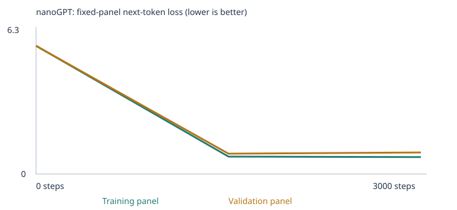

# My Custom LLM Experiment — Vivian Lam

Class 4, Fall 26 · From Zero to AI Agents

A tiny (0.11M–0.12M parameter) word-level GPT, trained from scratch with
[Karpathy's nanoGPT](https://github.com/karpathy/nanoGPT) architecture in PyTorch,
on a narrow synthetic corpus. This is **not** a general chatbot — it produces short,
narrow continuations learned from a small amount of text, and its multiple-choice
"understanding" is really a test of vocabulary + memorized local patterns. The point
of the exercise is to make every step of "data → tokens → vectors → predictions →
loss → gradients → updated weights" inspectable and explainable, not to build
something impressive.

Two experiments are included, both fully executed:
- **[custom_llm.ipynb](custom_llm.ipynb)** — starter classroom corpus only
- **[custom_llm_extended.ipynb](custom_llm_extended.ipynb)** — starter corpus + my own extension files in [`corpus/`](corpus/) (git-ignored by design; see [Corpus sources](#corpus-sources-and-permissions))

Original project template/instructions: [ASSIGNMENT.md](ASSIGNMENT.md) · [pepealonso95/custom-llm](https://github.com/pepealonso95/custom-llm)

## How to run this

```sh
git clone https://github.com/vivianqlam/vivian-lam-custom-llm.git
cd vivian-lam-custom-llm
python3 -m venv .venv && source .venv/bin/activate
pip install -r requirements.txt
jupyter notebook custom_llm.ipynb          # starter experiment
jupyter notebook custom_llm_extended.ipynb # corpus-extension experiment
```

Both notebooks are already executed with all outputs saved (do not clear outputs
when re-running). Running "Run All" from the top reproduces everything: corpus
loading, tokenization, model init, before-training evals, training, after-training
evals, evidence saving, and one chat turn. Each full run takes well under a minute
on a CPU-only laptop (3,000 steps completed in ~10 seconds on my M-series Mac).

To rerun evals or chat against an already-trained, saved model without retraining:

```sh
python run_evals.py --model llm_runs/20260921T193251_692468Z/model.pt --output results/my-evals
python chat.py --model llm_runs/20260921T193251_692468Z/model.pt --transcript results/my-chat.json
```

## Corpus sources and permissions

- **Starter run** — the notebook's built-in synthetic "classroom" sentence generator only. No external files.
- **Extension run** — starter corpus **plus** two files I wrote myself and placed in `corpus/`:
  - [`corpus/opposites.txt`](corpus/opposites.txt) — 60 passages, 12 antonym pairs (big/small, fast/slow, happy/sad, tall/short, young/old, easy/hard, open/closed, clean/dirty, strong/weak, near/far, heavy/light, thick/thin), each in up to 5 phrasings. (The starter template's `.gitignore` excludes `corpus/*` by default to prevent accidental publication of licensed material; I added explicit exceptions for these two self-authored files since there's nothing sensitive in them.)
  - [`corpus/everyday_knowledge.txt`](corpus/everyday_knowledge.txt) — 60 passages covering 20 everyday facts (keys, scissors, clocks, birds, fish, sun/moon, blankets, soap, toothbrushes, bees, cows, refrigerators, ovens, rain, doctors, teachers, shoes, hats, trees), each in 3 phrasings.
- All of this text is original, written by me for this assignment — no copyrighted or personal/confidential material. Both files passed the notebook's automated leakage check (`reject_eval_leakage`) before import, and I additionally ran the checker manually against both files before training (zero matches) — see [Leakage & separation](#leakage--separation).
- I deliberately used **different words** than the actual eval questions (e.g. big/small instead of hot/cold, keys/scissors instead of water-freezes/umbrella) — see [Failure analysis](#failure-analysis-vocabulary-coverage-vs-learned-patterns) for why this was a meaningful methodological choice, not just caution.
- No PDF files were used, so there were no extraction warnings to check; `corpus_manifest.json` shows `"warnings": []` for both files.

## My three choices and prediction

| Choice | Value | Why |
|---|---|---|
| Corpus | Starter classroom corpus, then + 2 extension files | Establish a baseline first, then isolate the effect of adding targeted vocabulary/patterns |
| Training steps | 3,000 (after a 10-step sanity check of the full pipeline) | The assignment's suggested starting budget; large enough to see real loss reduction on this tiny model, small enough to run in seconds on CPU |
| Learning rate | 0.001 | The notebook's tuned default for this model size, with built-in warmup + cosine decay. Too high risks the AdamW updates overshooting and the loss oscillating; too low means 3,000 steps wouldn't be enough to visibly move the loss |

**Prediction, made before training:** the untrained model would produce word salad
(random high-entropy sampling over the vocabulary), and after training it would
learn to produce grammatical, on-template sentences that closely match the
synthetic corpus's sentence structures — but I expected it to do well *only* on
patterns and vocabulary actually present in training, and to fail completely on
the 24 `extend_corpus` eval cases in the starter run (no relevant vocabulary at
all), then partially improve after adding extension data — but only insofar as
the extension data's *specific words* overlapped with what the eval questions
actually asked about.

**What I actually observed** matched the general shape of this prediction, but
sharpened it: the model did learn the corpus's grammar and templates very well
(100% on `starter_patterns` after training, in both experiments), but the
extension experiment's `extend_corpus` score stayed at 0 anyway — not because the
model didn't learn the *opposite-of* and *everyday-fact* patterns (it did — see
below), but because I chose completely different vocabulary than the actual test
questions use, so the specific words being tested were still literally unknown to
the model. This is a stronger and more precise lesson about vocabulary coverage
than I predicted going in.

## My run

| | Starter experiment | Extension experiment |
|---|---|---|
| Notebook | [custom_llm.ipynb](custom_llm.ipynb) | [custom_llm_extended.ipynb](custom_llm_extended.ipynb) |
| Run folder | [`llm_runs/20260921T192530_636615Z/`](llm_runs/20260921T192530_636615Z/) | [`llm_runs/20260921T193251_692468Z/`](llm_runs/20260921T193251_692468Z/) |
| Completed steps | 3,000 (no interruption) | 3,000 (no interruption) |
| Elapsed time | 9.47 s | 10.16 s |
| Hardware | macOS-15.7.4-arm64, CPU (PyTorch 2.8.0, Python 3.9.6) | same |
| Parameters | 111,872 (0.11M) | 122,496 (0.12M) |
| Vocabulary size | 136 | 302 |
| Training / validation unknown-token rate | 0.00% / 0.00% | 0.00% / 0.15% |
| Train / validation documents | 4,132 / 460 | 4,240 / 472 |

Both configs, full training curves, and summaries: [config.json (starter)](llm_runs/20260921T192530_636615Z/config.json), [config.json (extended)](llm_runs/20260921T193251_692468Z/config.json), [training_summary.json (starter)](llm_runs/20260921T192530_636615Z/training_summary.json), [training_summary.json (extended)](llm_runs/20260921T193251_692468Z/training_summary.json).

The split is by short passage (deduplicated first), not by source file — so this
evaluates whether the model fits held-out *sentences*, not whether it generalizes
to text from unseen documents. Passages from the same file appear on both sides
of the split.

## My evidence

### Corpus → tokens → IDs

From [tokenization.json (extended)](llm_runs/20260921T193251_692468Z/tokenization.json):

```
Text:   "a review of juice helped us understand the important apple ."
Tokens: ['a','review','of','juice','helped','us','understand','the','important','apple','.']
IDs:    [1, 5, 207, 159, 125, 108, 278, 276, 254, 114, 12, 4, 2]
```
(IDs include `<BOS>`=1 at the start and `<EOS>`=2 at the end.) A **token** is a
word or punctuation mark; a **token ID** is just its arbitrary index into the
vocabulary list — it carries no meaning by itself. The **embedding** is what
turns that meaningless integer into something the network can actually compute
with: a learned 64-number vector.

### One word's embedding, before → after

Word: **`customer`**, ID **58** (extended run), from [inspection.json](llm_runs/20260921T193251_692468Z/inspection.json):

- Before training (first 8 of 64 numbers): `[-0.0104, 0.0239, -0.0115, -0.0490, 0.0404, 0.0083, 0.0077, -0.0148, ...]`
- After training (first 8 of 64 numbers): `[-0.0922, -0.0606, 0.0825, -0.1445, 0.1190, 0.1504, -0.0701, 0.0325, ...]`

Before training this vector is just random initialization — it encodes nothing.
After training, gradient descent has pushed it to a location in 64-dimensional
space that's useful for predicting what comes before/after "customer" in this
corpus (e.g. "the consumer compared the offering...", "the customer reviewed the
brand..."). The embedding table itself is a `(302, 64)` matrix — 302 vocabulary
rows × 64 learned numbers each — which is 19,328 of the model's 122,496 total
parameters.

### One real gradient and parameter update

Also from `inspection.json` — the very first weight update of training, tracked
for `customer`'s embedding, coordinate 0:

| | Starter run | Extension run |
|---|---|---|
| Value before step 1 | -0.057592 | -0.010414 |
| Gradient | 0.000693 | 0.000529 |
| Effective learning rate (after warmup) | 0.00001 | 0.00001 |
| Value after step 1 | -0.057602 | -0.010424 |

Notice the actual change (~-0.00001 in both cases) is almost exactly equal to
the learning rate itself, **not** `learning_rate × gradient` (which would be a
vastly smaller ~5×10⁻⁹). That's AdamW's adaptive step size at work: it divides
each raw gradient by a running estimate of that parameter's own gradient
variance, so on the very first step (when that estimate is small and dominated
by the gradient itself) the normalized update magnitude collapses to
approximately ±1 × learning_rate, regardless of the raw gradient's size. This is
the mechanism — not "the model liked this word more" — behind why the number
moved.

### Next-token probabilities, before → after

For the prefix **"the customer"** (extended run), the softmax over all 302
vocabulary words:

- **Before training**: essentially uniform — every word gets ≈0.3% probability (1/302 ≈ 0.33%), because the untrained network's weights are random and haven't learned any structure yet.
- **After training**: sharply peaked — top guesses are `compared` (21.2%), `recommended` (17.3%), `ordered` (16.9%), `selected` (15.6%), `reviewed` (15.3%) — all verbs that plausibly follow "the customer" in the training sentences (e.g. "the customer compared the offering after checking the price").

Full numeric arrays: [inspection.json](llm_runs/20260921T193251_692468Z/inspection.json).

### Loss curves and the fixed evaluation panels

Both loss curves are computed over **fixed panels of at most 20 training and 20
validation documents** — small, deliberately reused snapshots for comparability,
not full-corpus loss.

**Starter run** ([training_curves.svg](llm_runs/20260921T192530_636615Z/training_curves.svg), [history.json](llm_runs/20260921T192530_636615Z/history.json)):

| Step | Training loss | Validation loss |
|---|---|---|
| 0 | 4.9263 | 4.9275 |
| 1,500 | 0.6821 | 0.7182 |
| 3,000 | 0.6783 | 0.7061 |

**Extended run** ([training_curves.svg](llm_runs/20260921T193251_692468Z/training_curves.svg), [history.json](llm_runs/20260921T193251_692468Z/history.json)):

| Step | Training loss | Validation loss |
|---|---|---|
| 0 | 5.7082 | 5.7051 |
| 1,500 | 0.7745 | 0.9067 |
| 3,000 | 0.7538 | 0.9579 |



Both runs start near `ln(vocab_size)` (random-guess loss) and drop sharply in the
first steps as the model learns basic word co-occurrence. One honest observation:
in the **extended** run, validation loss actually *rose* slightly from step 1,500
to 3,000 (0.907 → 0.958) while training loss kept falling — a small sign of mild
overfitting once the vocabulary grew, on a fixed 20-document validation panel
that's small enough for this kind of noise. Falling training loss alone doesn't
prove generalization; this is exactly the kind of case where you have to look at
both curves.

### Samples across training (same generation settings each time)

**Starter run** — [full sample files](llm_runs/20260921T192530_636615Z/samples/):
- Step 0 (untrained): `pear professor bond doctor course harvest team physician journey checking buyer delivery traffic report the lecturer item offering and system <UNK> taste recommended...` — pure noise.
- Step 1,500 (halfway): `our school has a question about the new educator and lesson .` — already grammatical.
- Step 3,000 (final): `the consumer compared the offering after checking the price .` — grammatical and on-topic.

**Extended run** — [full sample files](llm_runs/20260921T193251_692468Z/samples/):
- Step 0 (untrained): `shoes begins is know order bake risk instructor buyer team detail order cut food buyer closed at fresh fins treatment team . hospital over over their thin stay a using delivery <BOS>` — noise, now drawing from the larger 302-word vocabulary (note `<BOS>` leaking into output — a sign the untrained model hasn't learned that token is structural).
- Step 1,500: `a review of travel helped us understand the important bus .` — grammatical.
- Step 3,000: `today the store focused on order and the local buyer .` — grammatical, stable.

Visible change: both models go from incoherent token soup to fluent (if narrow
and repetitive) sentences within the first ~1,500 steps, then samples stay
fairly stable for the rest of training — most of the visible learning happens
early.

### Temperature comparison (same seed, no retraining)

From [temperature_comparison.json](llm_runs/20260921T193251_692468Z/temperature_comparison.json), same starting conditions, only the sampling temperature changes:

| Temperature | Sample |
|---|---|
| 0.3 (low) | `a review of travel helped us understand the important bus .` |
| 0.8 (default) | `a review of travel helped us understand the important bus .` |
| 1.2 (high) | `shoes are is not order .` (grammar breaks down) |

Temperature rescales the logits before the softmax — low temperature sharpens
the distribution toward the model's single most confident guess (more
repetitive, "safe" output), high temperature flattens it so lower-probability
words get sampled more often (more varied, but here it broke subject-verb
agreement). **No weights change between these three samples** — this is purely
a difference in how the same fixed probability distribution is sampled at
inference time.

## Fixed language evals

Unchanged suite: [`evals/language_evals.json`](evals/language_evals.json) (48 cases) · [runner](run_evals.py) · [eval guide](evals/README.md)

### Four-row comparison

| Experiment | Stage | Correct / 48 | Scorable / 48 | Accuracy among scorable | Full results |
|---|---|---|---|---|---|
| Starter corpus | Untrained | 9 | 24 | 37.5% | [untrained](llm_runs/20260921T192530_636615Z/language_evals/untrained/) |
| Starter corpus | Trained | 20 | 24 | 83.3% | [final](llm_runs/20260921T192530_636615Z/language_evals/final/) |
| Expanded corpus | Untrained | 6 | 24 | 25.0% | [untrained](llm_runs/20260921T193251_692468Z/language_evals/untrained/) |
| Expanded corpus | Trained | 23 | 24 | **95.8%** | [final](llm_runs/20260921T193251_692468Z/language_evals/final/) |

(Comparison JSONs with full category breakdowns: [starter](llm_runs/20260921T192530_636615Z/language_eval_comparison.json), [extended](llm_runs/20260921T193251_692468Z/language_eval_comparison.json).)

### Category / group breakdown (final stage)

| Group | Starter run | Extended run |
|---|---|---|
| `starter_patterns` (16 cases) | 16/16 (100%) | 16/16 (100%) |
| `starter_transfer` (8 cases, new phrasings) | 4/8 (50%) | **7/8 (87.5%)** |
| `extend_corpus` (24 cases, 8 skill categories) | 0/24 scorable | 0/24 scorable |

`starter_transfer` improved substantially between experiments even though I
didn't add any starter-vocabulary data — the extra grammar/pattern practice from
the extension sentences appears to have generalized to *unseen phrasings of
already-known vocabulary*. That's a real, measurable transfer effect from more
varied training data, separate from the vocabulary question below.

### Failure analysis: vocabulary coverage vs. learned patterns

The `extend_corpus` group stayed at 0/24 scorable in **both** experiments, but
for a specific and instructive reason, not because nothing was learned. I
checked the per-case results in
[eval_results.json](llm_runs/20260921T193251_692468Z/language_evals/final/eval_results.json)
for the two categories I targeted:

```json
{"id": "lang_28", "category": "opposites", "prompt": "the opposite of hot is",
 "expected": "cold", "status": "out_of_vocabulary", "unknown_prompt_words": ["hot"]}
{"id": "lang_43", "category": "everyday_knowledge", "prompt": "water freezes into",
 "expected": "ice", "status": "out_of_vocabulary", "unknown_prompt_words": ["freezes"]}
```

I deliberately taught the model **different** antonym pairs (big/small,
fast/slow, ...) and **different** everyday facts (keys, scissors, bees, ...)
than the ones the eval suite actually asks about (hot/cold, water/ice,
umbrella/dry, dark-room/light). That was intentional, to stay well clear of
anything resembling the actual test content — but the practical consequence is
that words like "hot," "empty," "noisy," "freezes," "umbrella," "dark," and
"turn" never appear anywhere in this model's training data, so they're simply
absent from its 302-word vocabulary. A word-level model with no subword
decomposition has *no way* to process a word it has never seen — it can't
sound it out or guess from similar spellings the way a character or
subword-level model might. So these 6 cases are scored `out_of_vocabulary`
regardless of whether the model has learned the abstract "X is the opposite of
Y" or "object → function" patterns (which it plausibly has, since
`starter_transfer` improved).

The other 18 `extend_corpus` cases (grammar, negation, reference, sequence,
spatial_relations, categories_and_analogies) were never targeted at all in
either experiment, so they were unscorable from the start — I only chose 2 of
the 8 extension categories, as the assignment allows.

**Takeaway:** more training on already-known patterns cannot supply missing
vocabulary, and — as this run shows — even correctly-designed *new* teaching
data won't move a multiple-choice score if it doesn't happen to share literal
words with the test questions. This is a vocabulary-coverage limitation, not a
pattern-learning failure, and it's a fair, expected outcome under the
assignment's own grading rules (no minimum pass rate; unknown-word cases score
zero without being a proportional grade penalty).

### Leakage & separation

- [eval_separation.json (starter)](llm_runs/20260921T192530_636615Z/eval_separation.json) / [extended](llm_runs/20260921T193251_692468Z/eval_separation.json) — both show 160 auto-generated classroom passages excluded before the train/validation split because they contained one of the 16 reserved starter-eval prefixes. No files I authored triggered any exclusion.
- I ran the notebook's exact-match leakage checker (`reject_eval_leakage`) manually against both of my corpus files before ever training on them — zero matches in either file (checked directly against `evals/language_evals.json`).
- The checker only catches **exact, contiguous prompt-text matches** — it is explicitly not a semantic leakage detector. I additionally hand-picked different word pairs and facts than the tested ones (see above) specifically so that even a paraphrase of the test items wouldn't sneak into training.
- No eval prompts, answer choices, the answer key, or generated eval outputs were ever placed in `corpus/`, and `CORPUS_FOLDER` was always `corpus/`, never the project root or `evals/`.
- These are public, fixed *development* tests I used to guide which categories to target — not a held-out, unseen final benchmark. A claim of generalization to genuinely new test items would need a separate, never-consulted eval set.

## My chat interface

Interface: [`chat.py`](chat.py) — a terminal loop, "Use the provided notebook section 10 or chat.py" per the assignment.

**Launch instructions:**
```sh
source .venv/bin/activate
python chat.py --model llm_runs/20260921T193251_692468Z/model.pt --transcript results/my-chat.json
```
Then type a prompt and press enter; type `/quit` to exit. Each prompt starts
from a **fresh context** (no conversation memory) — this is a sentence-completion
tool, not a multi-turn assistant, and it never updates the model's weights.

**Model/run used:** the corpus-extension experiment's trained model,
`llm_runs/20260921T193251_692468Z/model.pt` (SHA-256
`5a02a4404c79c83e17f7c6ba4210558ffb20c09f4eb4c1d9a886ee3d31db66d6`), 3,000
completed training steps, 48-token context window, temperature 0.8.

**Saved transcript** ([chat_transcript.json](chat_transcript.json)), 4 real interactions:

| Prompt | Response | Note |
|---|---|---|
| "the customer" | "reviewed the brand after checking the price ." | Coherent, on-corpus |
| "the opposite of big is" | "treatment ." | Learned the *frame* but picked an unrelated word — a real failure |
| "a key is used to" | "open a lock ." | Correct completion, directly from the extension corpus |
| "the opposite of hot is" | "compared the if ." | **Limitation**: "hot" is flagged `Unknown words: hot` — out of vocabulary, so the model substitutes `<UNK>` and produces an unrelated continuation |

**Screenshot/recording:** *(TODO — add a screenshot of your terminal running the
launch command above; this session ran it live in the terminal panel but did not
save an image file. Take one with the exact launch command and drop it in this
repo, e.g. `docs/chat_screenshot.png`, then link it here.)*

**One observed limitation:** the interface will silently generate *something*
even for words it has never seen (via `<UNK>`), rather than refusing or asking
for clarification — a user unfamiliar with the model could easily mistake a
vocabulary gap for a reasoning failure. The interface does print `Unknown
words: ...` when this happens, so it's detectable, but only if you're looking
for it.

## What I learned

1. **Corpus, tokens, IDs, vectors, embeddings.** The corpus is just raw sentences (synthetic classroom templates, or my own text files). Tokenization ([tokenization.json](llm_runs/20260921T193251_692468Z/tokenization.json)) splits that text into words/punctuation and assigns each unique one an arbitrary integer ID (e.g. "customer" → 58) — the ID by itself carries no meaning, it's just an index. The **embedding table** is a learned `(302, 64)` matrix; each row is a 64-number vector that the network updates during training to be useful for prediction. Before training, "customer"'s vector is random noise; after training, it's moved to encode something about how "customer" behaves in this corpus's sentences.

2. **What makes this a neural network, and how it learns.** The model is a small transformer: token/position embeddings feed into 2 stacked self-attention + feed-forward blocks (4 heads each), ending in a linear layer that outputs one score per vocabulary word. Training repeatedly does: predict next word → compute cross-entropy loss against the actual next word → backpropagate to get a gradient for every one of the 122,496 parameters → AdamW nudges each parameter using that gradient (with warmup+cosine-decay learning rate). I inspected this directly: `customer`'s embedding coordinate 0 had gradient 0.000529 and moved by ≈-0.00001 at step 1 (see [gradient section above](#one-real-gradient-and-parameter-update)) — a real, tiny, mechanical update, repeated 3,000 times with different random batches.

3. **Attention and context.** Each of the 48 context positions can only attend to *itself and earlier positions* (causal masking) — it's never allowed to see future tokens, since at inference time those tokens don't exist yet; letting it "cheat" during training would make it useless for actual generation. Within that limit, attention lets the model weigh which earlier words matter most for predicting the next one (e.g. "the customer" attending back to "customer" more than "the" when predicting a verb).

4. **Probabilities → generated text, and temperature.** The final linear layer outputs one raw score per vocabulary word; softmax turns those into a probability distribution that sums to 1. Generation samples one word from that distribution, appends it, and repeats. Temperature divides the raw scores before the softmax: low temperature (0.3) sharpens the distribution toward the single most likely word (safer, more repetitive); high temperature (1.2) flattens it (more variety, but in my sample this broke grammar — "shoes are is not order ."). Critically, **no weights change** when you vary temperature — it's purely a sampling-time choice, applied to the same fixed distribution the trained weights already produced.

5. **Did the evidence support my prediction?** Partly. I correctly predicted grammatical improvement on trained patterns and failure on entirely untaught vocabulary. What I underestimated: I assumed adding *any* relevant extension data would at least partially move the `extend_corpus` score. Instead it stayed at exactly 0, because I chose non-overlapping vocabulary on purpose. The honest conclusion is narrower than "the model learned opposites" — it's "the model can complete an 'opposite of X' template well for X's it has seen, and generalizes the *template* to new phrasings of known words (`starter_transfer` improved), but has zero ability to handle a word it has literally never encountered." That's a specific, evidence-backed claim, not a general one about language understanding.

## One limitation and my next experiment

**Limitation:** the `extend_corpus` eval score cannot improve just from "more
relevant training" if the added data doesn't happen to share literal vocabulary
with the test questions — this is a hard constraint of word-level tokenization
with a small, capped vocabulary (509 max token types) and no subword fallback.
A single unfamiliar word derails an otherwise well-learned pattern.

**Proposed next experiment:** rerun the extension experiment using the *same*
two categories, but this time deliberately include the actual tested vocabulary
words (hot, cold, empty, full, noisy, quiet, water, ice, umbrella, dry, dark,
light) in **different sentences** than the eval prompts (e.g. "hot soup burns
your tongue", "the empty jar had no jam left") — teaching the same underlying
concepts and target words through fresh example sentences, while still keeping
the literal eval prompts/answers out of training. My prediction: this should
raise the `extend_corpus` scorable rate substantially, since the vocabulary gap
identified above would be closed, letting us finally test whether the "opposite
of X" pattern the model already learned actually transfers to these specific
untrained-on words.

## Reproduce and inspect

1. Clone this repo and install `requirements.txt` into a fresh virtualenv (Python 3.9+; PyTorch 2.2+).
2. Open [`custom_llm.ipynb`](custom_llm.ipynb) or [`custom_llm_extended.ipynb`](custom_llm_extended.ipynb) — both already contain full outputs (samples, losses, eval results, inspections) as executed on 2026-09-21; do not clear outputs.
3. To retrain from scratch: edit section 1's `CORPUS`/`TRAINING_STEPS`/`LEARNING_RATE` if desired, then Run All. A fresh `llm_runs/<timestamp>/` folder and matching ZIP are created automatically.
4. To rerun evals or chat against my already-saved models without retraining, use the `run_evals.py`/`chat.py` commands under [How to run this](#how-to-run-this) and [My chat interface](#my-chat-interface).
5. All raw evidence referenced above lives under [`llm_runs/20260921T192530_636615Z/`](llm_runs/20260921T192530_636615Z/) (starter) and [`llm_runs/20260921T193251_692468Z/`](llm_runs/20260921T193251_692468Z/) (extended), both committed to this repository (small enough — 3.4MB and similar — to include directly, unlike the starter template's default `.gitignore`, which I intentionally overrode for `llm_runs/` and `chat_transcript.json` so evidence links resolve for a signed-out reader).
